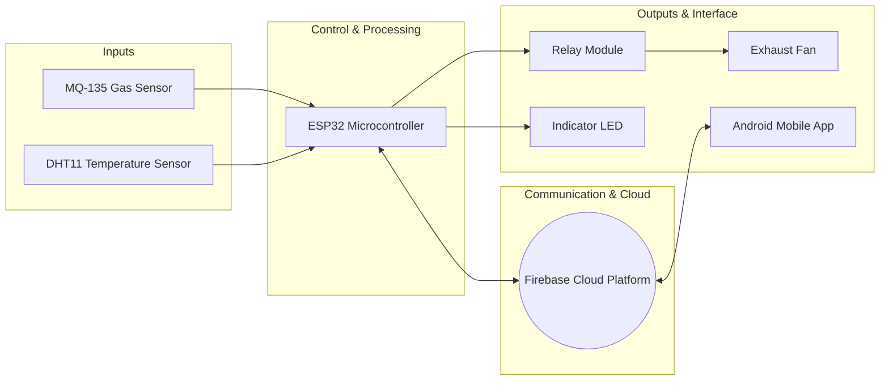

# Block Diagram Code (Mermaid.js)

Copy and paste this code into the [Mermaid Live Editor](https://mermaid.live/) to generate the diagram.

```mermaid
graph LR
    subgraph Inputs
        MQ135[MQ-135 Gas Sensor]
        DHT11[DHT11 Temperature Sensor]
    end

    subgraph "Control & Processing"
        ESP32[ESP32 Microcontroller]
    end

    subgraph "Communication & Cloud"
        Firebase((Firebase Cloud Platform))
    end

    subgraph "Outputs & Interface"
        Relay[Relay Module]
        Fan[Exhaust Fan]
        LED[Indicator LED]
        Android[Android Mobile App]
    end

    %% Flow connections
    MQ135 --> ESP32
    DHT11 --> ESP32
    
    ESP32 <--> Firebase
    
    Firebase <--> Android
    
    ESP32 --> Relay
    Relay --> Fan
    ESP32 --> LED
```
